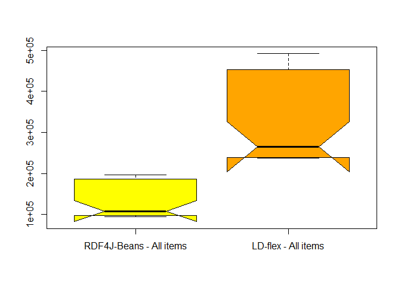
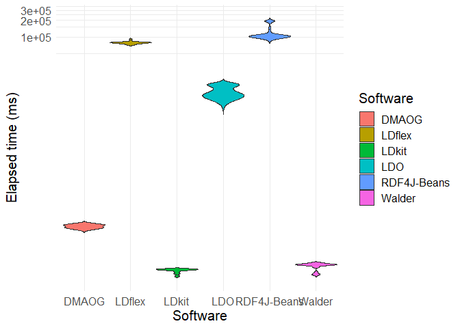
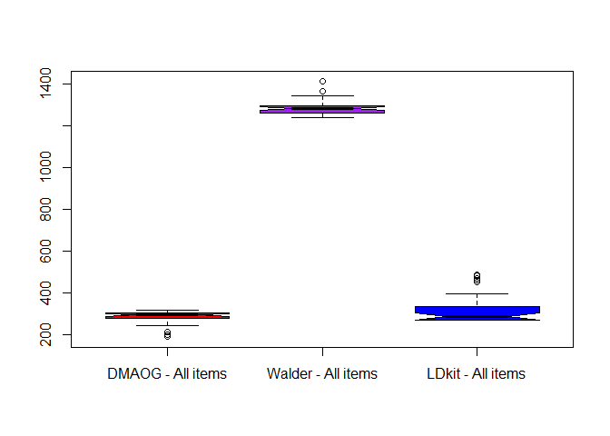
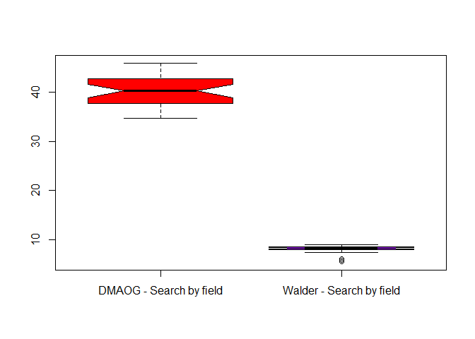
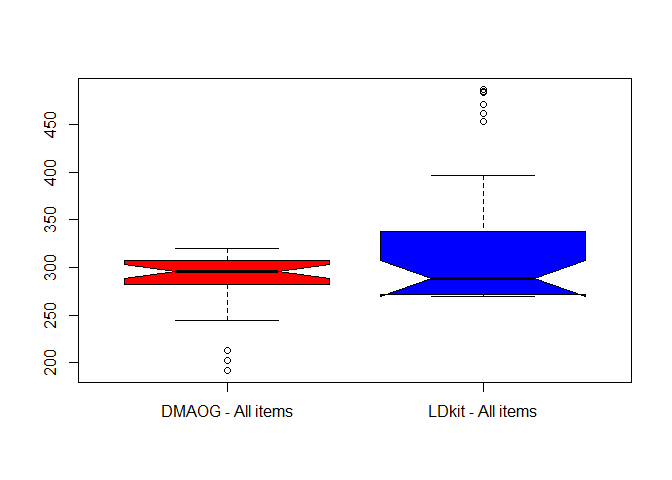

## Loading the dataset

Firstly we have to load the dataset from Github from the available
project repository:

``` r
dataset <- read.csv("https://raw.githubusercontent.com/herminiogg/dmaog-paper-evaluation/master/StatisticalAnalysis/dmaogEvaluationDataset.csv")[, 2:4]
```

## Descriptive statistics

We obtain the descriptive statistics for each of the tools that we have
tested. We include in this analysis the mean, the median, the standard
deviation the minimum and the maximum:

``` r
stby(dataset, dataset$Software, descr, round.digits=5, stats=c("mean", "med", "sd", "min", "max"))
```

    ## Non-numerical variable(s) ignored: Software

    ## Descriptive Statistics  
    ## dataset  
    ## Group: Software = DMAOG  
    ## N: 30  
    ## 
    ##                 All_items   Search_by_fields
    ## ------------- ----------- ------------------
    ##          Mean   286.37433           40.32700
    ##        Median   295.98500           40.26500
    ##       Std.Dev    32.84225            3.24248
    ##           Min   191.53000           34.77000
    ##           Max   319.83000           45.89000
    ## 
    ## Group: Software = LDflex  
    ## N: 30  
    ## 
    ##                    All_items   Search_by_fields
    ## ------------- -------------- ------------------
    ##          Mean   330439.20000        78588.40000
    ##        Median   264983.50000        78572.00000
    ##       Std.Dev   100614.20413         3849.31820
    ##           Min   237190.00000        71486.00000
    ##           Max   491882.00000        91023.00000
    ## 
    ## Group: Software = LDkit  
    ## N: 30  
    ## 
    ##                 All_items   Search_by_fields
    ## ------------- ----------- ------------------
    ##          Mean   328.36167          326.38633
    ##        Median   288.18000          303.30000
    ##       Std.Dev    78.95476           88.84282
    ##           Min   269.86000          240.12000
    ##           Max   486.50000          496.74000
    ## 
    ## Group: Software = RDF4J-Beans  
    ## N: 30  
    ## 
    ##                    All_items   Search_by_fields
    ## ------------- -------------- ------------------
    ##          Mean   130250.46667       122011.90000
    ##        Median   107894.50000       103271.50000
    ##       Std.Dev    41574.46506        36393.75126
    ##           Min    94509.00000        95807.00000
    ##           Max   196460.00000       197449.00000
    ## 
    ## Group: Software = Walder  
    ## N: 30  
    ## 
    ##                  All_items   Search_by_fields
    ## ------------- ------------ ------------------
    ##          Mean   1288.61333            7.91860
    ##        Median   1282.00000            8.20150
    ##       Std.Dev     36.31465            0.98018
    ##           Min   1236.90000            5.42300
    ##           Max   1409.40000            8.95600

## Testing normality

In order to see if we can apply a One-Way ANOVA over the results we must
ensure firstly that each of the data series are following a normal
distribution. For this we will test again for each of the series that is
combination of the tool and the tested method.

Results for “All items” methods:

``` r
by(dataset$All_items, dataset$Software, shapiro.test)
```

    ## dataset$Software: DMAOG
    ## 
    ##  Shapiro-Wilk normality test
    ## 
    ## data:  dd[x, ]
    ## W = 0.7735, p-value = 2.236e-05
    ## 
    ## ------------------------------------------------------------ 
    ## dataset$Software: LDflex
    ## 
    ##  Shapiro-Wilk normality test
    ## 
    ## data:  dd[x, ]
    ## W = 0.76975, p-value = 1.931e-05
    ## 
    ## ------------------------------------------------------------ 
    ## dataset$Software: LDkit
    ## 
    ##  Shapiro-Wilk normality test
    ## 
    ## data:  dd[x, ]
    ## W = 0.71509, p-value = 2.606e-06
    ## 
    ## ------------------------------------------------------------ 
    ## dataset$Software: RDF4J-Beans
    ## 
    ##  Shapiro-Wilk normality test
    ## 
    ## data:  dd[x, ]
    ## W = 0.73109, p-value = 4.572e-06
    ## 
    ## ------------------------------------------------------------ 
    ## dataset$Software: Walder
    ## 
    ##  Shapiro-Wilk normality test
    ## 
    ## data:  dd[x, ]
    ## W = 0.88507, p-value = 0.003693

Results for “Search by fields” methods:

``` r
by(dataset$Search_by_fields, dataset$Software, shapiro.test)
```

    ## dataset$Software: DMAOG
    ## 
    ##  Shapiro-Wilk normality test
    ## 
    ## data:  dd[x, ]
    ## W = 0.96491, p-value = 0.4107
    ## 
    ## ------------------------------------------------------------ 
    ## dataset$Software: LDflex
    ## 
    ##  Shapiro-Wilk normality test
    ## 
    ## data:  dd[x, ]
    ## W = 0.92549, p-value = 0.03733
    ## 
    ## ------------------------------------------------------------ 
    ## dataset$Software: LDkit
    ## 
    ##  Shapiro-Wilk normality test
    ## 
    ## data:  dd[x, ]
    ## W = 0.80722, p-value = 8.902e-05
    ## 
    ## ------------------------------------------------------------ 
    ## dataset$Software: RDF4J-Beans
    ## 
    ##  Shapiro-Wilk normality test
    ## 
    ## data:  dd[x, ]
    ## W = 0.64269, p-value = 2.528e-07
    ## 
    ## ------------------------------------------------------------ 
    ## dataset$Software: Walder
    ## 
    ##  Shapiro-Wilk normality test
    ## 
    ## data:  dd[x, ]
    ## W = 0.75809, p-value = 1.234e-05

Looking to the results we can see that the the null hypothesis (the
sample is following a normal distribution) is rejected in most of the
cases, meaning that they those samples are not following a normal
distribution and thereby we cannot apply a One-Way ANOVA to them as this
is one of the assumptions of this test.

## Testing for differences of means

After the obtained results on normality distribution we can opt for a
non-parametric test for difference of means. In this case we will use
the Kruskal-Wallis test in which the null hypothesis assumes that the
distributions have no differences.

Results for “All items” method:

``` r
kruskal.test(All_items ~ Software, data = dataset)
```

    ## 
    ##  Kruskal-Wallis rank sum test
    ## 
    ## data:  All_items by Software
    ## Kruskal-Wallis chi-squared = 135.96, df = 4, p-value < 2.2e-16

Results for “Search by fields” method:

``` r
kruskal.test(Search_by_fields ~ Software, data = dataset)
```

    ## 
    ##  Kruskal-Wallis rank sum test
    ## 
    ## data:  Search_by_fields by Software
    ## Kruskal-Wallis chi-squared = 143.05, df = 4, p-value < 2.2e-16

In the light of these results we can see that in both cases the null
hypothesis is rejected and the significance of this difference can be
classified as statistically highly significant with the significance
level p \< 0.001.

## Testing differences between groups

The Kruskal-Wallis tests tells us that there are differences between the
four given distributions, however with it we cannot exactly know between
which groups are those differences. For this purpouse we need to run a
post hoc analysis. In this case we will use the Dunn’s Test using the
Benjamini-Hochberg procedure.

Results for “All items” method:

``` r
dunnTest(All_items ~ Software, data = dataset, method = "bh")
```

    ## Warning: Software was coerced to a factor.

    ## Dunn (1964) Kruskal-Wallis multiple comparison

    ##   p-values adjusted with the Benjamini-Hochberg method.

    ##              Comparison          Z      P.unadj        P.adj
    ## 1        DMAOG - LDflex -9.4881207 2.352369e-21 2.352369e-20
    ## 2         DMAOG - LDkit -0.2555523 7.982966e-01 7.982966e-01
    ## 3        LDflex - LDkit  9.2325684 2.642189e-20 1.321094e-19
    ## 4   DMAOG - RDF4J-Beans -6.8137365 9.509581e-12 3.169860e-11
    ## 5  LDflex - RDF4J-Beans  2.6743842 7.486664e-03 8.318515e-03
    ## 6   LDkit - RDF4J-Beans -6.5581843 5.446689e-11 1.361672e-10
    ## 7        DMAOG - Walder -4.1393524 3.482877e-05 5.804794e-05
    ## 8       LDflex - Walder  5.3487683 8.855482e-08 1.771096e-07
    ## 9        LDkit - Walder -3.8838001 1.028365e-04 1.469092e-04
    ## 10 RDF4J-Beans - Walder  2.6743842 7.486664e-03 9.358330e-03

In the case of the “All items” method we can see that there are very
significant differences (p \< 0.001) between:

-   DMAOG and LDflex
-   DMAOG and RDF4J-Beans
-   DMAOG and Walder
-   LDlfex and LDkit
-   LDkit and RDF4J-Beans
-   LDKit and Walder
-   LDflex and Walder

There are also significant differences (p \< 0.05) between:

-   RDF4J-Beans and Walder
-   LDflex and RDF4J-Beans

Interestingly, there are no significant differences between DMAOG and
LDkit.

In addition we can calculate the effect size to see how strong is the
seen relation:

    ## Registered S3 methods overwritten by 'car':
    ##   method       from
    ##   hist.boot    FSA 
    ##   confint.boot FSA

    ## 
    ## Attaching package: 'rstatix'

    ## The following object is masked from 'package:stats':
    ## 
    ##     filter

``` r
d_all_items <- dunn_test(All_items ~ Software, data = dataset, p.adjust.method = "BH")
d_all_items$r <- d_all_items$statistic / sqrt(d_all_items$n1+d_all_items$n2)
d_all_items[, c(1,2,3,10)]
```

    ## # A tibble: 10 × 4
    ##    .y.       group1      group2            r
    ##    <chr>     <chr>       <chr>         <dbl>
    ##  1 All_items DMAOG       LDflex       1.22  
    ##  2 All_items DMAOG       LDkit        0.0330
    ##  3 All_items DMAOG       RDF4J-Beans  0.880 
    ##  4 All_items DMAOG       Walder       0.534 
    ##  5 All_items LDflex      LDkit       -1.19  
    ##  6 All_items LDflex      RDF4J-Beans -0.345 
    ##  7 All_items LDflex      Walder      -0.691 
    ##  8 All_items LDkit       RDF4J-Beans  0.847 
    ##  9 All_items LDkit       Walder       0.501 
    ## 10 All_items RDF4J-Beans Walder      -0.345

As we can see from the previous results the effect size is large (r \>
0.5) as per Cohen suggested values of effect size for r. Therefore, we
can ensure that:

-   DMAOG is faster than LDflex, RDF4J-Beans and Walder
-   LDkit is faster than LDflex and RDF4J-Beans and Walder

However, we cannot ensure with the same certainty, due to medium (r \<=
0.5 and r \> 0.3) or small effect size (r \<= 0.3), that:

-   Walder is faster than RDF4J-Beans
-   RDF4J-Beans is faster than LDflex

Results for “Search by fields” method:

``` r
dunnTest(Search_by_fields ~ Software, data = dataset, method = "bh")
```

    ## Warning: Software was coerced to a factor.

    ## Dunn (1964) Kruskal-Wallis multiple comparison

    ##   p-values adjusted with the Benjamini-Hochberg method.

    ##              Comparison         Z      P.unadj        P.adj
    ## 1        DMAOG - LDflex -5.348768 8.855482e-08 1.475914e-07
    ## 2         DMAOG - LDkit -2.674384 7.486664e-03 7.486664e-03
    ## 3        LDflex - LDkit  2.674384 7.486664e-03 8.318515e-03
    ## 4   DMAOG - RDF4J-Beans -8.023152 1.030653e-15 3.435510e-15
    ## 5  LDflex - RDF4J-Beans -2.674384 7.486664e-03 9.358330e-03
    ## 6   LDkit - RDF4J-Beans -5.348768 8.855482e-08 1.771096e-07
    ## 7        DMAOG - Walder  2.674384 7.486664e-03 1.069523e-02
    ## 8       LDflex - Walder  8.023152 1.030653e-15 5.153265e-15
    ## 9        LDkit - Walder  5.348768 8.855482e-08 2.213871e-07
    ## 10 RDF4J-Beans - Walder 10.697537 1.045199e-26 1.045199e-25

In this case there are very significant differences (p \< 0.001)
between:

-   DMAOG and LDflex
-   DMAOG and RDF4J-Beans
-   LDkit and RDF4J-Beans
-   RDF4J-Beans and Walder
-   LDflex and Walder
-   LDkit and Walder

There are significant differences (p \< 0.05) between:

-   DMAOG and LDkit
-   LDflex and LDkit
-   LDflex and RDF4J-Beans
-   DMAOG and Walder

Calculating the effect size:

``` r
d_search_by_fields <- dunn_test(Search_by_fields ~ Software, data = dataset, p.adjust.method = "BH")
d_search_by_fields$r <- d_search_by_fields$statistic / sqrt(d_search_by_fields$n1+d_search_by_fields$n2)
d_search_by_fields[, c(1,2,3,10)]
```

    ## # A tibble: 10 × 4
    ##    .y.              group1      group2           r
    ##    <chr>            <chr>       <chr>        <dbl>
    ##  1 Search_by_fields DMAOG       LDflex       0.691
    ##  2 Search_by_fields DMAOG       LDkit        0.345
    ##  3 Search_by_fields DMAOG       RDF4J-Beans  1.04 
    ##  4 Search_by_fields DMAOG       Walder      -0.345
    ##  5 Search_by_fields LDflex      LDkit       -0.345
    ##  6 Search_by_fields LDflex      RDF4J-Beans  0.345
    ##  7 Search_by_fields LDflex      Walder      -1.04 
    ##  8 Search_by_fields LDkit       RDF4J-Beans  0.691
    ##  9 Search_by_fields LDkit       Walder      -0.691
    ## 10 Search_by_fields RDF4J-Beans Walder      -1.38

We can see that pairing the previously obtained significance values
there are large effect sizes (r \> 0.5) between:

-   DMAOG and LDflex (being DMAOG faster)
-   DMAOG and RDF4J-Beans (DMAOG is faster)
-   RDF4J-Beans and Walder (Walder is faster)
-   LDflex and Walder (Walder is faster)
-   LDkit and RDF4J-Beans (LDkit is faster)
-   LDkit and Walder (Walder is faster)

We see medium size effects (r \<= 0.5 and r \> 0.3) between:

-   LDflex and RDF4J-Beans (being LDflex faster)
-   DMAOG and Walder (being in this case Walder faster).
-   DMAOG and LDkit (DMAOG is faster)
-   LDflex and LDkit (LDkit is faster)

So we can corroborate that the previously observed differences and
performance classification are statistically valid, so we can classify
their performance depending on the used method:

All items: DMAOG/LDkit, Walder, RDF4J-Beans, LDflex Search by fields:
Walder, DMAOG, LDkit, LDflex and RDF4J-Beans

# Visualising the differences

We then can visualise these differences in a box plot where the
differences can be become more evident. For that we are going to analyse
the tools that interchange their position in best performance between
the two tested methods:

RDF4J-Beans and LDflex:

``` r
boxplot(
  filter(dataset, Software == "RDF4J-Beans")$All_items, 
  filter(dataset, Software == "LDflex")$All_items, 
  names=c("RDF4J-Beans - All items", "LDflex - All items"),
  notch=TRUE,
  col=c("yellow", "orange"))
```

    ## Warning in (function (z, notch = FALSE, width = NULL, varwidth = FALSE, : some
    ## notches went outside hinges ('box'): maybe set notch=FALSE



``` r
boxplot(
  filter(dataset, Software == "RDF4J-Beans")$Search_by_fields, 
  filter(dataset, Software == "LDflex")$Search_by_fields,
  names=c("RDF4J-Beans - Search by field", "LDflex - Search by field"),
  notch=TRUE,
  col=c("yellow", "orange"))
```

    ## Warning in (function (z, notch = FALSE, width = NULL, varwidth = FALSE, : some
    ## notches went outside hinges ('box'): maybe set notch=FALSE



DMAOG, Walder and LDkit:

``` r
boxplot(
  filter(dataset, Software == "DMAOG")$All_items, 
  filter(dataset, Software == "Walder")$All_items, 
  filter(dataset, Software == "LDkit")$All_items, 
  names=c("DMAOG - All items", "Walder - All items", "LDkit - All items"),
  notch=TRUE,
  col=c("red", "purple", "blue"))
```

    ## Warning in (function (z, notch = FALSE, width = NULL, varwidth = FALSE, : some
    ## notches went outside hinges ('box'): maybe set notch=FALSE



``` r
boxplot(
  filter(dataset, Software == "DMAOG")$Search_by_fields, 
  filter(dataset, Software == "Walder")$Search_by_fields,
  names=c("DMAOG - Search by field", "Walder - Search by field"),
  notch=TRUE,
  col=c("red", "purple"))
```



It is also interesting to plot the differences between DMAOG and LDkit
in the “All items” method as just analysing the mean can deliver to
erroneous conclusions. As we can see in the plot both distributions
notches overlap which suggest that the are no significant differences
between both distributions.

``` r
boxplot(
  filter(dataset, Software == "DMAOG")$All_items, 
  filter(dataset, Software == "LDkit")$All_items, 
  names=c("DMAOG - All items", "LDkit - All items"),
  notch=TRUE,
  col=c("red", "blue"))
```

    ## Warning in (function (z, notch = FALSE, width = NULL, varwidth = FALSE, : some
    ## notches went outside hinges ('box'): maybe set notch=FALSE


