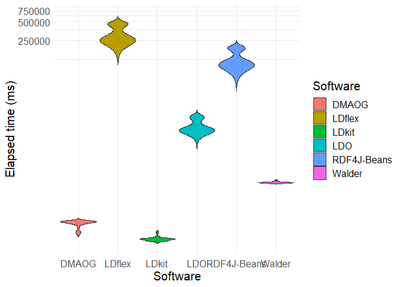

## Loading the dataset

Firstly we have to load the dataset from Github from the available
project repository:

``` r
dataset <- read.csv("C:\\Users\\Herminio\\Desktop\\ExamplesDMAOGPaper\\StatisticalAnalysis\\dmaogEvaluationDataset.csv")[, 2:4]
```

## Descriptive statistics

We obtain the descriptive statistics for each of the tools that we have
tested. We include in this analysis the mean, the median, the standard
deviation the minimum and the maximum:

``` r
stby(dataset, dataset$Software, descr, round.digits=5, stats=c("mean", "med", "sd", "min", "max"))
```

    ## Non-numerical variable(s) ignored: Software

    ## Descriptive Statistics  
    ## dataset  
    ## Group: Software = DMAOG  
    ## N: 30  
    ## 
    ##                 All_items   Search_by_fields
    ## ------------- ----------- ------------------
    ##          Mean   286.37433           40.32700
    ##        Median   295.98500           40.26500
    ##       Std.Dev    32.84225            3.24248
    ##           Min   191.53000           34.77000
    ##           Max   319.83000           45.89000
    ## 
    ## Group: Software = LDflex  
    ## N: 30  
    ## 
    ##                    All_items   Search_by_fields
    ## ------------- -------------- ------------------
    ##          Mean   330439.20000        78588.40000
    ##        Median   264983.50000        78572.00000
    ##       Std.Dev   100614.20413         3849.31820
    ##           Min   237190.00000        71486.00000
    ##           Max   491882.00000        91023.00000
    ## 
    ## Group: Software = LDkit  
    ## N: 30  
    ## 
    ##                 All_items   Search_by_fields
    ## ------------- ----------- ------------------
    ##          Mean   159.77200            6.52687
    ##        Median   157.57000            6.67650
    ##       Std.Dev    13.86107            0.51276
    ##           Min   146.03000            5.02900
    ##           Max   208.85000            7.06100
    ## 
    ## Group: Software = LDO  
    ## N: 30  
    ## 
    ##                   All_items   Search_by_fields
    ## ------------- ------------- ------------------
    ##          Mean   10691.00667        10855.62000
    ##        Median    9323.75000        10031.50000
    ##       Std.Dev    2654.65321         2524.43007
    ##           Min    7973.10000         7398.80000
    ##           Max   15519.10000        14454.90000
    ## 
    ## Group: Software = RDF4J-Beans  
    ## N: 30  
    ## 
    ##                    All_items   Search_by_fields
    ## ------------- -------------- ------------------
    ##          Mean   130250.46667       122011.90000
    ##        Median   107894.50000       103271.50000
    ##       Std.Dev    41574.46506        36393.75126
    ##           Min    94509.00000        95807.00000
    ##           Max   196460.00000       197449.00000
    ## 
    ## Group: Software = Walder  
    ## N: 30  
    ## 
    ##                  All_items   Search_by_fields
    ## ------------- ------------ ------------------
    ##          Mean   1288.61333            7.91860
    ##        Median   1282.00000            8.20150
    ##       Std.Dev     36.31465            0.98018
    ##           Min   1236.90000            5.42300
    ##           Max   1409.40000            8.95600

## Testing normality

In order to see if we can apply a One-Way ANOVA over the results we must
ensure firstly that each of the data series are following a normal
distribution. For this we will test again for each of the series that is
combination of the tool and the tested method.

Results for “All items” methods:

``` r
by(dataset$All_items, dataset$Software, shapiro.test)
```

    ## dataset$Software: DMAOG
    ## 
    ##  Shapiro-Wilk normality test
    ## 
    ## data:  dd[x, ]
    ## W = 0.7735, p-value = 2.236e-05
    ## 
    ## ------------------------------------------------------------ 
    ## dataset$Software: LDflex
    ## 
    ##  Shapiro-Wilk normality test
    ## 
    ## data:  dd[x, ]
    ## W = 0.76975, p-value = 1.931e-05
    ## 
    ## ------------------------------------------------------------ 
    ## dataset$Software: LDkit
    ## 
    ##  Shapiro-Wilk normality test
    ## 
    ## data:  dd[x, ]
    ## W = 0.74943, p-value = 8.916e-06
    ## 
    ## ------------------------------------------------------------ 
    ## dataset$Software: LDO
    ## 
    ##  Shapiro-Wilk normality test
    ## 
    ## data:  dd[x, ]
    ## W = 0.78716, p-value = 3.859e-05
    ## 
    ## ------------------------------------------------------------ 
    ## dataset$Software: RDF4J-Beans
    ## 
    ##  Shapiro-Wilk normality test
    ## 
    ## data:  dd[x, ]
    ## W = 0.73109, p-value = 4.572e-06
    ## 
    ## ------------------------------------------------------------ 
    ## dataset$Software: Walder
    ## 
    ##  Shapiro-Wilk normality test
    ## 
    ## data:  dd[x, ]
    ## W = 0.88507, p-value = 0.003693

Results for “Search by fields” methods:

``` r
by(dataset$Search_by_fields, dataset$Software, shapiro.test)
```

    ## dataset$Software: DMAOG
    ## 
    ##  Shapiro-Wilk normality test
    ## 
    ## data:  dd[x, ]
    ## W = 0.96491, p-value = 0.4107
    ## 
    ## ------------------------------------------------------------ 
    ## dataset$Software: LDflex
    ## 
    ##  Shapiro-Wilk normality test
    ## 
    ## data:  dd[x, ]
    ## W = 0.92549, p-value = 0.03733
    ## 
    ## ------------------------------------------------------------ 
    ## dataset$Software: LDkit
    ## 
    ##  Shapiro-Wilk normality test
    ## 
    ## data:  dd[x, ]
    ## W = 0.80293, p-value = 7.417e-05
    ## 
    ## ------------------------------------------------------------ 
    ## dataset$Software: LDO
    ## 
    ##  Shapiro-Wilk normality test
    ## 
    ## data:  dd[x, ]
    ## W = 0.86527, p-value = 0.001317
    ## 
    ## ------------------------------------------------------------ 
    ## dataset$Software: RDF4J-Beans
    ## 
    ##  Shapiro-Wilk normality test
    ## 
    ## data:  dd[x, ]
    ## W = 0.64269, p-value = 2.528e-07
    ## 
    ## ------------------------------------------------------------ 
    ## dataset$Software: Walder
    ## 
    ##  Shapiro-Wilk normality test
    ## 
    ## data:  dd[x, ]
    ## W = 0.75809, p-value = 1.234e-05

Looking to the results we can see that the the null hypothesis (the
sample is following a normal distribution) is rejected in most of the
cases, meaning that they those samples are not following a normal
distribution and thereby we cannot apply a One-Way ANOVA to them as this
is one of the assumptions of this test.

## Testing for differences of means

After the obtained results on normality distribution we can opt for a
non-parametric test for difference of means. In this case we will use
the Kruskal-Wallis test in which the null hypothesis assumes that the
distributions have no differences.

Results for “All items” method:

``` r
kruskal.test(All_items ~ Software, data = dataset)
```

    ## 
    ##  Kruskal-Wallis rank sum test
    ## 
    ## data:  All_items by Software
    ## Kruskal-Wallis chi-squared = 173.97, df = 5, p-value < 2.2e-16

Results for “Search by fields” method:

``` r
kruskal.test(Search_by_fields ~ Software, data = dataset)
```

    ## 
    ##  Kruskal-Wallis rank sum test
    ## 
    ## data:  Search_by_fields by Software
    ## Kruskal-Wallis chi-squared = 171.93, df = 5, p-value < 2.2e-16

In the light of these results we can see that in both cases the null
hypothesis is rejected and the significance of this difference can be
classified as statistically highly significant with the significance
level p \< 0.001.

## Testing differences between groups

The Kruskal-Wallis tests tells us that there are differences between the
four given distributions, however with it we cannot exactly know between
which groups are those differences. For this purpose we need to run a
post hoc analysis. In this case we will use the Dunn’s Test using the
Benjamini-Hochberg procedure.

Results for “All items” method:

``` r
dunnTest(All_items ~ Software, data = dataset, method = "bh")
```

    ## Warning: Software was coerced to a factor.

    ## Dunn (1964) Kruskal-Wallis multiple comparison

    ##   p-values adjusted with the Benjamini-Hochberg method.

    ##              Comparison         Z      P.unadj        P.adj
    ## 1        DMAOG - LDflex -8.926967 4.378468e-19 3.283851e-18
    ## 2         DMAOG - LDkit  2.215018 2.675885e-02 2.675885e-02
    ## 3        LDflex - LDkit 11.141985 7.835324e-29 1.175299e-27
    ## 4           DMAOG - LDO -4.467200 7.924999e-06 1.698214e-05
    ## 5          LDflex - LDO  4.459767 8.204874e-06 1.367479e-05
    ## 6           LDkit - LDO -6.682218 2.353529e-11 5.883822e-11
    ## 7   DMAOG - RDF4J-Beans -6.697084 2.126198e-11 7.973244e-11
    ## 8  LDflex - RDF4J-Beans  2.229884 2.575517e-02 2.759483e-02
    ## 9   LDkit - RDF4J-Beans -8.912101 5.007431e-19 2.503715e-18
    ## 10    LDO - RDF4J-Beans -2.229884 2.575517e-02 2.971751e-02
    ## 11       DMAOG - Walder -2.237317 2.526566e-02 3.445317e-02
    ## 12      LDflex - Walder  6.689651 2.237038e-11 6.711115e-11
    ## 13       LDkit - Walder -4.452334 8.494181e-06 1.274127e-05
    ## 14         LDO - Walder  2.229884 2.575517e-02 3.219397e-02
    ## 15 RDF4J-Beans - Walder  4.459767 8.204874e-06 1.538414e-05

In the case of the “All items” method we can see that there are very
significant differences (p \< 0.001) between:

-   DMAOG and LDflex
-   DMAOG and RDF4J-Beans
-   LDflex and LDkit
-   LDkit and RDF4J-Beans
-   LDflex and Walder
-   RDF4J-Beans and Walder
-   DMAOG and LDO
-   LDflex and LDO
-   LDkit and LDO
-   LDKit and Walder

There are also significant differences (p \< 0.05) between:

-   LDflex and RDF4J-Beans
-   LDO and RDF4J-Beans
-   LDO and Walder
-   DMAOG and Walder
-   DMAOG and LDKit

Interestingly, there are no significant differences between DMAOG and
LDkit.

In addition we can calculate the effect size to see how strong is the
seen relation:

    ## Registered S3 methods overwritten by 'car':
    ##   method       from
    ##   hist.boot    FSA 
    ##   confint.boot FSA

    ## 
    ## Attaching package: 'rstatix'

    ## The following object is masked from 'package:stats':
    ## 
    ##     filter

``` r
d_all_items <- dunn_test(All_items ~ Software, data = dataset, p.adjust.method = "BH")
d_all_items$r <- d_all_items$statistic / sqrt(d_all_items$n1+d_all_items$n2)
d_all_items[, c(1,2,3,10)]
```

    ## # A tibble: 15 × 4
    ##    .y.       group1      group2           r
    ##    <chr>     <chr>       <chr>        <dbl>
    ##  1 All_items DMAOG       LDflex       1.15 
    ##  2 All_items DMAOG       LDkit       -0.286
    ##  3 All_items DMAOG       LDO          0.577
    ##  4 All_items DMAOG       RDF4J-Beans  0.865
    ##  5 All_items DMAOG       Walder       0.289
    ##  6 All_items LDflex      LDkit       -1.44 
    ##  7 All_items LDflex      LDO         -0.576
    ##  8 All_items LDflex      RDF4J-Beans -0.288
    ##  9 All_items LDflex      Walder      -0.864
    ## 10 All_items LDkit       LDO          0.863
    ## 11 All_items LDkit       RDF4J-Beans  1.15 
    ## 12 All_items LDkit       Walder       0.575
    ## 13 All_items LDO         RDF4J-Beans  0.288
    ## 14 All_items LDO         Walder      -0.288
    ## 15 All_items RDF4J-Beans Walder      -0.576

As we can see from the previous results the effect size is large (r \>
0.5) as per Cohen suggested values of effect size for r. Therefore, we
can ensure that:

-   DMAOG is faster than LDflex, RDF4J-Beans and LDO
-   LDkit is faster than LDflex and RDF4J-Beans, LDO and Walder
-   LDO is faster than LDflex
-   Walder is faster than RDF4J-Beans
-   LDflex is faster than Walder

However, we cannot ensure with the same certainty, due to medium (r \<=
0.5 and r \> 0.3) or small effect size (r \<= 0.3), that:

-   Walder is faster than LDO
-   RDF4J-Beans is faster than LDflex
-   DMAOG is faster than Walder
-   LDO is faster than RDF4J-Beans
-   LDkit is faster than DMAOG

Results for “Search by fields” method:

``` r
dunnTest(Search_by_fields ~ Software, data = dataset, method = "bh")
```

    ## Warning: Software was coerced to a factor.

    ## Dunn (1964) Kruskal-Wallis multiple comparison

    ##   p-values adjusted with the Benjamini-Hochberg method.

    ##              Comparison          Z      P.unadj        P.adj
    ## 1        DMAOG - LDflex  -4.459767 8.204874e-06 1.367479e-05
    ## 2         DMAOG - LDkit   4.192181 2.762852e-05 4.144279e-05
    ## 3        LDflex - LDkit   8.651948 5.062757e-18 2.531379e-17
    ## 4           DMAOG - LDO  -2.229884 2.575517e-02 2.759483e-02
    ## 5          LDflex - LDO   2.229884 2.575517e-02 2.971751e-02
    ## 6           LDkit - LDO  -6.422065 1.344382e-10 3.360956e-10
    ## 7   DMAOG - RDF4J-Beans  -6.689651 2.237038e-11 6.711115e-11
    ## 8  LDflex - RDF4J-Beans  -2.229884 2.575517e-02 3.219397e-02
    ## 9   LDkit - RDF4J-Beans -10.881832 1.407064e-27 2.110596e-26
    ## 10    LDO - RDF4J-Beans  -4.459767 8.204874e-06 1.538414e-05
    ## 11       DMAOG - Walder   2.497470 1.250832e-02 1.705680e-02
    ## 12      LDflex - Walder   6.957237 3.470114e-12 1.301293e-11
    ## 13       LDkit - Walder  -1.694712 9.013016e-02 9.013016e-02
    ## 14         LDO - Walder   4.727353 2.274654e-06 4.874259e-06
    ## 15 RDF4J-Beans - Walder   9.187120 4.034981e-20 3.026236e-19

In this case there are very significant differences (p \< 0.001)
between:

-   DMAOG and LDflex
-   DMAOG and RDF4J-Beans
-   LDkit and RDF4J-Beans
-   RDF4J-Beans and Walder
-   LDflex and Walder
-   LDflex and LDkit
-   LDO and Walder
-   LDO and RDF4J-Beans
-   DMAOG and LDkit
-   LDkit and LDO

There are significant differences (p \< 0.05) between:

-   LDflex and RDF4J-Beans
-   DMAOG and Walder
-   LDflex and LDO
-   DMAOG and LDO

There are no significant differences:

-   LDkit and Walder

Calculating the effect size:

``` r
d_search_by_fields <- dunn_test(Search_by_fields ~ Software, data = dataset, p.adjust.method = "BH")
d_search_by_fields$r <- d_search_by_fields$statistic / sqrt(d_search_by_fields$n1+d_search_by_fields$n2)
d_search_by_fields[, c(1,2,3,10)]
```

    ## # A tibble: 15 × 4
    ##    .y.              group1      group2           r
    ##    <chr>            <chr>       <chr>        <dbl>
    ##  1 Search_by_fields DMAOG       LDflex       0.576
    ##  2 Search_by_fields DMAOG       LDkit       -0.541
    ##  3 Search_by_fields DMAOG       LDO          0.288
    ##  4 Search_by_fields DMAOG       RDF4J-Beans  0.864
    ##  5 Search_by_fields DMAOG       Walder      -0.322
    ##  6 Search_by_fields LDflex      LDkit       -1.12 
    ##  7 Search_by_fields LDflex      LDO         -0.288
    ##  8 Search_by_fields LDflex      RDF4J-Beans  0.288
    ##  9 Search_by_fields LDflex      Walder      -0.898
    ## 10 Search_by_fields LDkit       LDO          0.829
    ## 11 Search_by_fields LDkit       RDF4J-Beans  1.40 
    ## 12 Search_by_fields LDkit       Walder       0.219
    ## 13 Search_by_fields LDO         RDF4J-Beans  0.576
    ## 14 Search_by_fields LDO         Walder      -0.610
    ## 15 Search_by_fields RDF4J-Beans Walder      -1.19

We can see that pairing the previously obtained significance values
there are large effect sizes (r \> 0.5) between:

-   DMAOG and LDflex (being DMAOG faster)
-   DMAOG and RDF4J-Beans (DMAOG is faster)
-   RDF4J-Beans and Walder (Walder is faster)
-   LDflex and Walder (Walder is faster)
-   LDkit and RDF4J-Beans (LDkit is faster)
-   LDflex and LDkit (LDkit is faster)
-   LDO and RDF4J-Beans (LDO is faster)
-   LDO and Walder (walder is faster)
-   DMAOG and LDkit (LDkit is faster)
-   LDkit and LDO (LDkit is faster)

We see low or medium effect size effects (r \<= 0.5) between:

-   LDflex and RDF4J-Beans (being LDflex faster)
-   DMAOG and Walder (being in this case Walder faster).
-   LDflex and LDO (LDO is faster)
-   DMAOG and LDO (DMAOG is faster)

So we can corroborate that the previously observed differences and
performance classification are statistically valid, so we can classify
their performance depending on the used method:

All items: LDkit \> DMAOG \> Walder \> LDO \> RDF4J-Beans \> LDflex
Search by fields: LDkit/Walder \> DMAOG \> LDO \> LDflex \> RDF4J-Beans

# Visualising the differences

We can represent these differences graphically by means of a violin plot
which will help the interpretation of these results. However, as the
values can vary greatly among the different tools it is necessary to
transform the coordinates so that the results can be interpreted more
easily.

Violin plot representation for the All items method where the y axis has
been transformed based on a log10 scale:

``` r
dataset %>%
    ggplot(aes(fill=Software, y=All_items, x=Software)) +
        geom_violin(trim=FALSE, scale="width") + 
        coord_trans(y="log10") +
        theme_minimal() + 
        ylab("Elapsed time (ms)") +
        theme(legend.position="right", text = element_text(size=15))
```



Violin plot representation for the Search by fields method where the y
axis has been transformed based on a log10 scale:

``` r
dataset %>%
    ggplot(aes(fill=Software, y=Search_by_fields, x=Software)) +
        geom_violin(trim=FALSE, scale="width") + 
        coord_trans(y="log10") +
        theme_minimal() + 
        ylab("Elapsed time (ms)") +
        theme(legend.position="right", text = element_text(size=15))
```


